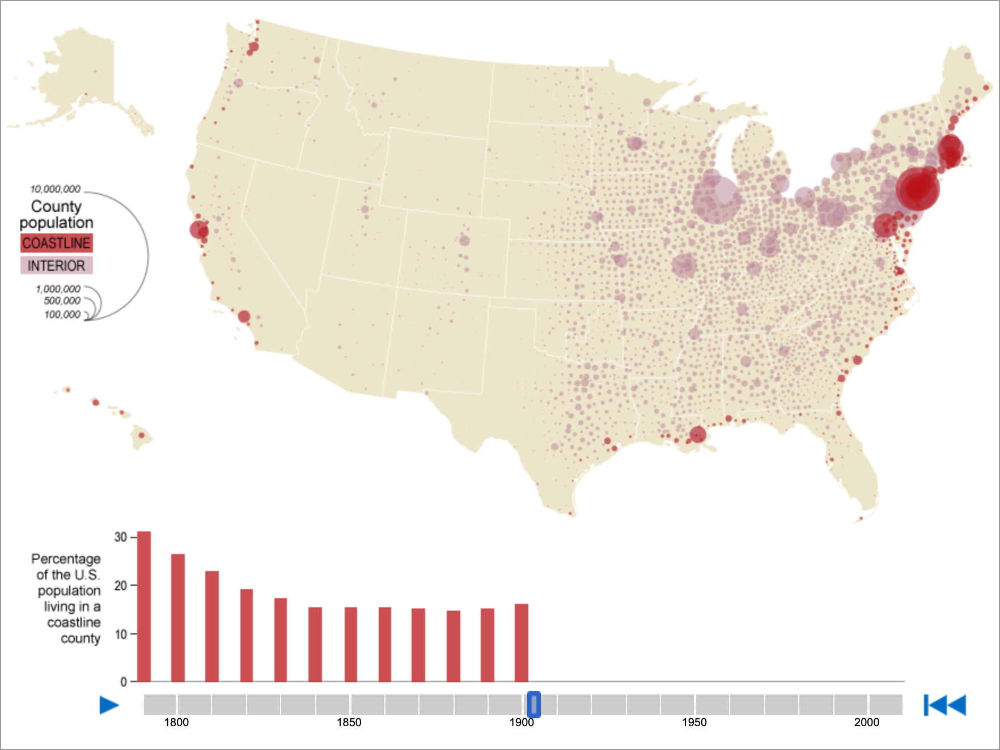
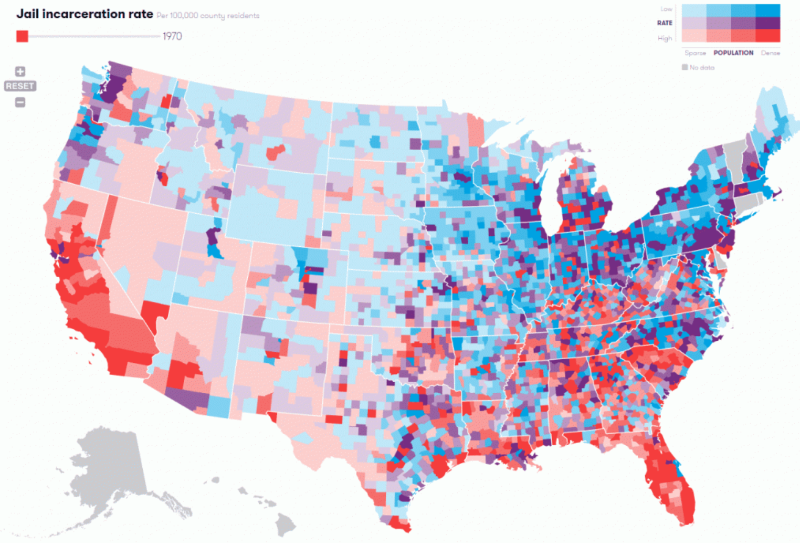

# Info201 Project Report
## Green with Envy: Are We Meeting Our Renewable Potential?
Code Name: Info201_project
##### Vicky Liu (yunshl2@uw.edu)
##### Madeline Harp (madharp@uw.edu)
##### Jenna Truong (truong1j@uw.edu)
##### Daniel Kim (ddk22@uw.edu)

Info-201: Technical Foundations of Informatics\
The Information School\
University of Washington\
Autumn 2019

### 1.0 Introduction
#### 1.1 Problem Situation
Washington is said to be one of the nation’s largest producers of renewable energy and we hope to analyze the production potential and actual generation of green energy across the United States. Within green energy production, we find that there are many stakeholders including but not limited to energy companies, energy consumers (residential, commercial, industrial, and transportation sectors), and environmentalists. A piece of policy that touches on the topic of green energy is Washington state passing law requiring 100% clean energy by 2045.
#### 1.2 What is the problem?
There are ample areas for improvement in terms of energy efficiency, one of which is utilizing renewable energy production across the United States that are not being used to their full potential. We will find which states are using fully reaching their potential and which states are not by comparing their current production to the potentiality of their production.  
#### 1.3 Why does it matter?
If Washington is able to improve upon their energy usage and production, the state should consider viable options to optimize and enhance the current state of their energy production. The state of Washington has already taken strides in the right directions. For instance, a legislation was passed last spring that outlined the state’s plan to mandate carbon-free sourced energy. Though this expedites the process of reaching a clean sourced energy grid, is there room for more?
#### 1.4 How it will be addressed?
We will be creating data visualizations to show the variance in production and potential of reusable energy, hopefully creating a sense of a need to mobilize and fight for greener energy in Washington as well as other states. We will also provide an outline or discussion describing our findings and what steps can be taken to maximize green energy production.

### 2.0 Research Questions
Is Washington State maximizing its renewable energy production?

How does Washington compare to other states in terms of renewable energy production and production potential?

### 3.0 Possible data sets
Our first data set is from data.world, and called United States Renewable Energy Technical Potential. The data set consists of 51 rows and 31 columns which give information about the generation potential of various renewable energy sources by state.

 [United-states-renewable-energy-technical-potential-1.csv](https://data.world/us-doe-gov/6a295b3b-31ff-440f-acef-f4f91760ff27/workspace/file?filename=united-states-renewable-energy-technical-potential-1.csv)

Our second data set outlines the energy production of the United States (by state) over the course of the last twenty years. There are five columns which outline the year, state, type of energy producer, energy source, and the total generation from each source. This data set contains over 50,000 rows of data ranging from 1990 to 2018.

[Net Generation by State by Type of Producer by Energy Source (EIA-906, EIA-920, and EIA-923)1](https://www.eia.gov/electricity/data/state/)

### 4.0 Information Visualization

*Figure 1.* This data visualization could be especially relevant to our project with how it encodes size and magnitude. We could do something similar and use circles of varying opacity and size to indicate what areas of the United States is producing the cleanest, most renewable energy. At the bottom of the display, we could have a bar graph that breaks down the greatest producers of renewable energy to smallest producers in a left-to-right orientation. \
(*Source:* US Census) [1]

*Figure 2.* We could also develop a data visualization that splits producers of renewable energy and encodes production by color. We could have a scale or key at the bottom of the display that has colors correspond to various levels of production. \
(*Source:* Vera) [2]

### 5.0 Team Coordination
**Weekly time(s) that everyone in the group can get together for at least 2 hours**
* Wednesday 8 pm - 10 pm

**Your individual goal(s) for the project and your roles**
* Daniel - To gain a better understanding of how to utilize code to gain insights on complex data sets.
* Jenna - Practice creating data visualizations and learn how I can utilize these skills going forward with my environmental studies work.
* Vicky - Practice using R to access the data and also get a better understanding on data analysis.
* Madeline - Practice the skills associated with data visualization while also focusing on modern environmental discourse.

**A commitment on how you will communicate weekly**
* We will communicate weekly through our iMessage group chat and update each other on progress.

**A commitment on how you will give each other feedback on working together and how you will address communication challenges or work breakdowns**
* Critique sessions during weekly team meetings.

### 6.0 Questions for Teaching Team
None at the moment.

### 7.0 References
[1] United States Census. (2012). [Interactive map showing percentage of the U.S. population living in a coastline county.]. Coastline County Population. Retrieved from https://www.census.gov/dataviz/

[2] Vera. (2018). [Interactive map showing the jail incarceration rate in different counties in the United States.]. Incarceration Trends. Retrieved from http://trends.vera.org/incarceration-rates
