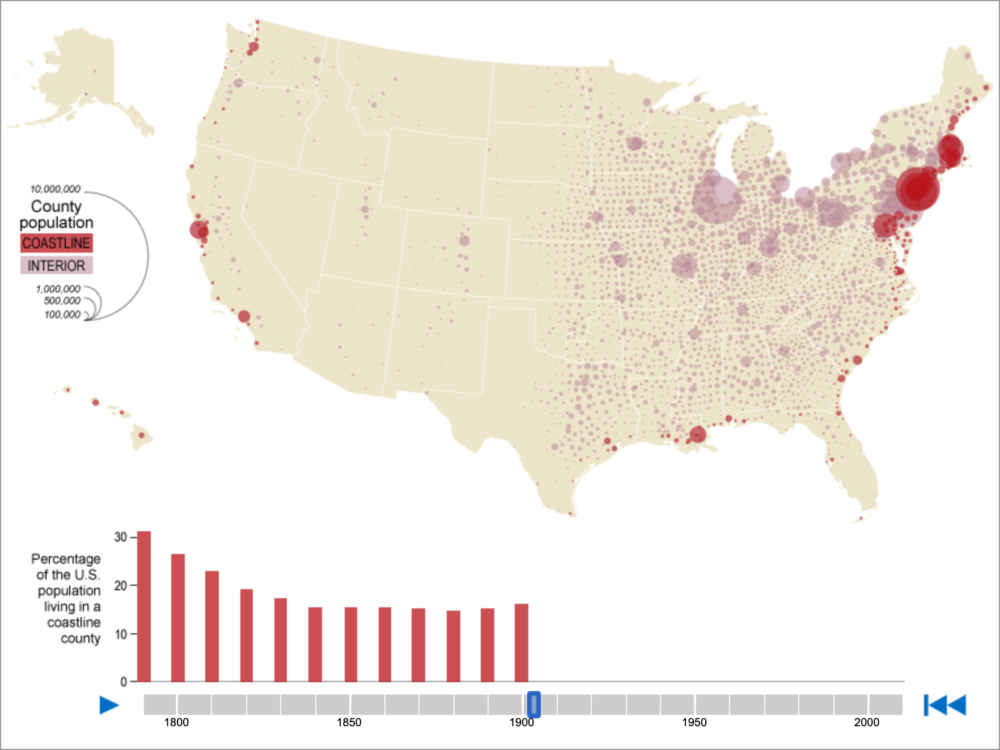
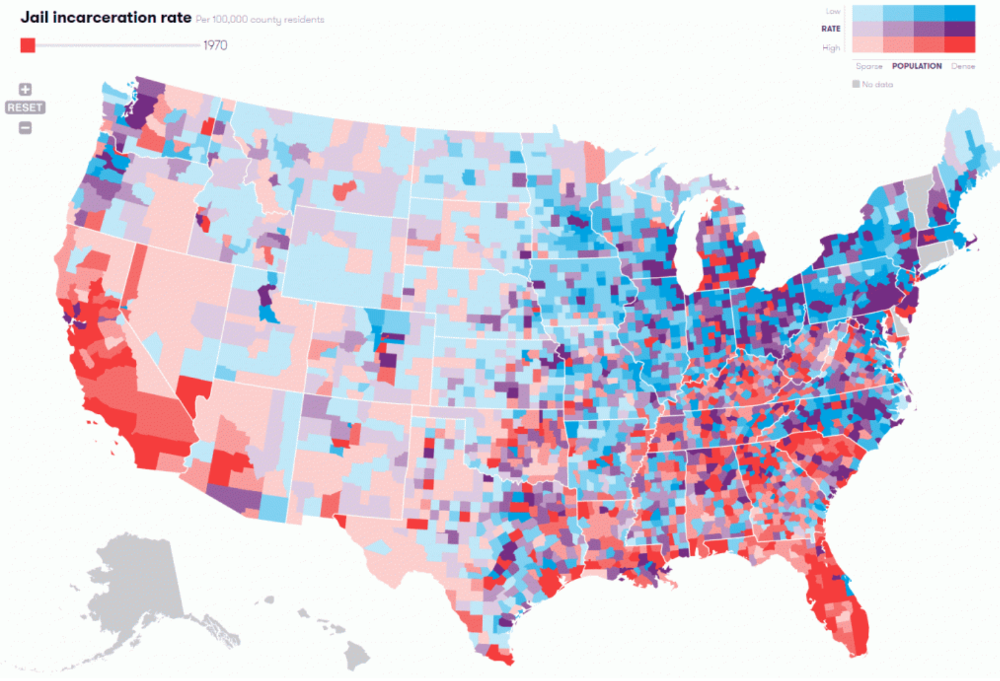

# Info201 Project Report
## Green with Envy: Are We Meeting Our Renewable Potential?
Code Name: Info201_project
##### Vicky Liu (yunshl2@uw.edu)
##### Madeline Harp (madharp@uw.edu)
##### Jenna Truong (truong1j@uw.edu)
##### Daniel Kim (ddk22@uw.edu)

Info-201: Technical Foundations of Informatics\
The Information School\
University of Washington\
Autumn 2019

### 1.0 Introduction
#### 1.1 Problem Situation
What we have:
Washington is said to be one of the nation’s largest producers of renewable energy and we hope to analyze the production potential and actual generation of green energy across the United States. Within green energy production, we find that there are many stakeholders including but not limited to energy companies, energy consumers (residential, commercial, industrial, and transportation sectors), and environmentalists. A piece of policy that touches on the topic of green energy is Washington state passing law requiring 100% clean energy by 2045.

What is required:
Describe the general problem situation, by answering these and similar questions: What is the setting of the problem? Who are the direct and indirect stakeholders (see the Envisioning Cards). What values and tensions are in play for societies and individual people? What are the general issues at stake? What policy and ethical elements bear on the problem? What other work has been done in this area? How are building on this work? Why do you care about this problem and what motivates you to work on it?
You employ the Envisioning Cards to address these and similar questions about the social implications and the ethical considerations of your work.

#### 1.2 What is the problem?
What we have:
There are ample areas for improvement in terms of energy efficiency, one of which is utilizing renewable energy production across the United States that are not being used to their full potential. We will find which states are using fully reaching their potential and which states are not by comparing their current production to the potentiality of their production.  

What is required:
Given the a description of the problem situation, what is the specific problem? Aim for a clear, concise, and interesting statement of the problem.

#### 1.3 Why does it matter?
Whate we have:
If Washington is able to improve upon their energy usage and production, the state should consider viable options to optimize and enhance the current state of their energy production. The state of Washington has already taken strides in the right directions. For instance, a legislation was passed last spring that outlined the state’s plan to mandate carbon-free sourced energy. Though this expedites the process of reaching a clean sourced energy grid, is there room for more?

What is required:
Why does the problem matter? Why is it important? Who cares about it?

#### 1.4 How it will be addressed?
What we have:
We will be creating data visualizations to show the variance in production and potential of reusable energy, hopefully creating a sense of a need to mobilize and fight for greener energy in Washington as well as other states. We will also provide an outline or discussion describing our findings and what steps can be taken to maximize green energy production.

What is required:
In general, how will you address the problem? In general, what kinds of data wrangling and information visualizations will be used? In general, who is the audience for your work?

### 2.0 Research Questions
How does Washington compare to other states in terms of renewable energy production and production potential?

### 3.0 Possible data sets
What we have:
Our first data set is from data.world, and called United States Renewable Energy Technical Potential. The data set consists of 51 rows and 31 columns which give information about the generation potential of various renewable energy sources by state.

 [United-states-renewable-energy-technical-potential-1.csv](https://data.world/us-doe-gov/6a295b3b-31ff-440f-acef-f4f91760ff27/workspace/file?filename=united-states-renewable-energy-technical-potential-1.csv)

Our second data set outlines the energy production of the United States (by state) over the course of the last twenty years. There are five columns which outline the year, state, type of energy producer, energy source, and the total generation from each source. This data set contains over 50,000 rows of data ranging from 1990 to 2018.

[Net Generation by State by Type of Producer by Energy Source (EIA-906, EIA-920, and EIA-923)1](https://www.eia.gov/electricity/data/state/)

What is required:
You describe the original data set, answering such questions as: (1) Who created it? (2) Why was it created? (3) Where did you access it? (4) What represents an “observation”? (5) What “variables” does each observation have? (6) How big is the data set? If it is a sub-set of a larger data set, how was the sub-set created? (7) If the data set represents people, who has been included and who has been excluded?
You employ the envisioning cards to clarify the strengths and weaknesses of the data set(s).
You describe the strengths and the weaknesses of the data set.
Data wrangling. You discuss how you organized and cleaned your data. How did you reshape your data? How are missing values handled?
You refer to the appendix: Data Dictionary.

### 4.0 Information Visualization
What we have:

*Figure 1.* This data visualization could be especially relevant to our project with how it encodes size and magnitude. We could do something similar and use circles of varying opacity and size to indicate what areas of the United States is producing the cleanest, most renewable energy. At the bottom of the display, we could have a bar graph that breaks down the greatest producers of renewable energy to smallest producers in a left-to-right orientation. \
(*Source:* US Census) [1]

*Figure 2.* We could also develop a data visualization that splits producers of renewable energy and encodes production by color. We could have a scale or key at the bottom of the display that has colors correspond to various levels of production. \
(*Source:* Vera) [2]

What is required:
You describe your approach for visualizing the data sets. This section should be quite closely linked to your research questions. You describe the specific choices you’ve made for visualizing the data

### 5.0 Technical Description of Shiny Application
You describe how your Shiny application is built. You describe its major components and how they work. Key questions to answer: (1) How did you load your data (e.g., .csv file, API, etc.)? (2) What major libraries did you use? (3) How did you organize your code (directories and code files)? (4) What questions, if any, will you be answering with statistical analysis/machine learning?

### 6.0 Conclusion
You should summarize: (1) The strengths and weaknesses of the project; (2) The main lessons that you learned; and (3) The future work that you or someone else might pursue.

### Acknowledgements 
Use this optional element to acknowledge anyone who substantially helped you with your project.

### References
[1] United States Census. (2012). [Interactive map showing percentage of the U.S. population living in a coastline county.]. Coastline County Population. Retrieved from https://www.census.gov/dataviz/

[2] Vera. (2018). [Interactive map showing the jail incarceration rate in different counties in the United States.]. Incarceration Trends. Retrieved from http://trends.vera.org/incarceration-rates

### Appendix 1: Data Dictionary
In this appendix you should describe the variables that make up your data set, including: The name of the variable, a description of its meaning, the data type, and the measurement type. A suggestion format is a table such as this:

### Appendix 2: Reflections
In this appendix each team member should write a personal reflection on the project [> 150 words]. Topics might include: What you learned, what you found satisfying/frustrating, what you would do differently in the future, how the project positioned you develop your identity for coder, thinker, and innovator, and so forth.

### Appendix 3: Use of Envisioning Cards
In this appendix include a brief discussion of how you used the envisioning cards.
